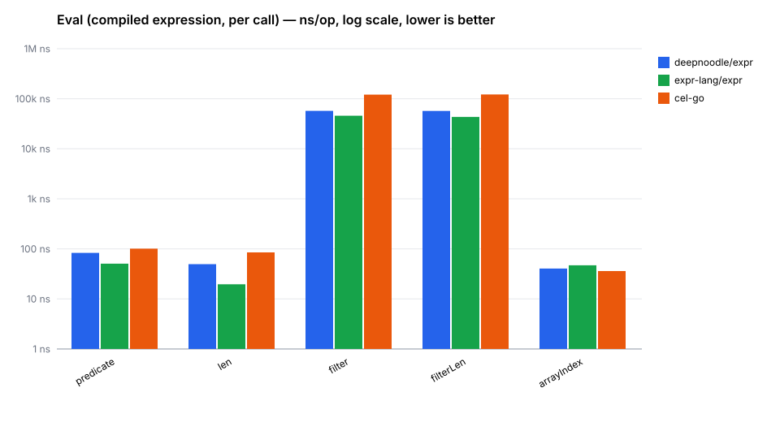

# expr

A small expression language for Go programs. You write a line that looks like
Go, `expr` compiles it, and you run it against whatever data you have lying
around: a map, a struct, a pointer to a struct. Handy for conditions,
templates, and little bits of user-supplied logic you don't want to turn into
a full plugin system.

It is built directly on `go/parser`, so the syntax will feel familiar: it is
mostly a subset of Go's own expression grammar, with a few ergonomic additions
like JSON-style object and array literals.

## Install

```sh
go get github.com/deepnoodle-ai/expr
```

## Expressions

If you can read Go, you can read most `expr`. The inputs are plain values from
your host program; expressions select fields, call the functions you expose,
and produce a value.

```go
// Boolean conditions over maps, structs, or JSON-shaped data.
user.age >= 18 && contains(user.roles, "admin")

// Select fields, index lists, and call only the functions your app registers.
sprintf("%s <%s>", user.name, lower(user.emails[0]))

// JSON-style arrays and objects are expression values too.
{
    "ok":            user.age >= 18,
    "display_name":  upper(user.name),
    "public_roles":  filter(user.roles, it != "internal"),
    "primary_email": user.emails[0],
}

// Higher-order forms bind `it` and `index` for each element.
any(orders, it.status == "paid" && count(it.items, it.price >= 100) > 0)
```

Every snippet above is still a single expression: no statements, no mutation,
no loops, no function definitions. Your Go code decides which data and
functions are visible.

## Templates

Templates use the same expressions inside `${...}`. Each expression is compiled
once at construction time. It is evaluated again on every `Render`.

```go
tmpl, err := expr.NewTemplate(
    `Hello ${user.name}! You have ${len(filter(tasks, !it.done))} task(s).`,
    expr.WithBuiltins(),
)
out, err := tmpl.Render(ctx, env)
```

The text outside `${...}` is just text. The expression inside can use the same
selectors, functions, literals, and higher-order forms as any other compiled
expression.

## Using the Go API

```go
p, err := expr.Compile(
    `user.age >= 18 && contains(user.roles, "admin")`,
    expr.WithBuiltins(),
)
if err != nil {
    panic(err)
}

ok, err := p.Run(ctx, map[string]any{
    "user": map[string]any{
        "age":   36,
        "roles": []any{"admin", "editor"},
    },
})
if err != nil {
    panic(err)
}
fmt.Println(ok) // true
```

`Compile` does the parsing work once. The returned `*Program` is immutable and
safe to share between goroutines. Compile at startup. Run per request.

No functions are registered by default, so the surface area is exactly as wide
as you want it. `WithBuiltins()` opts you into a small standard set (`len`,
`contains`, `has`, `keys`, `upper`, `lower`, `int`, `float`, `string`, `bool`,
`sprintf`). `WithFunctions` lets you register any Go function as a callable
identifier:

```go
p, err := expr.Compile(`greet(upper(name))`, expr.WithFunctions(map[string]any{
    "upper": strings.ToUpper,
    "greet": func(name string) string { return "Hello, " + name + "!" },
}))
```

Mix and match, or skip the builtins entirely and expose only the handful that
make sense for your sandbox. Opt-in groups — `expr.MathFuncs()` (`min`, `max`,
`abs`, `floor`, `ceil`, `round`), `expr.StringFuncs()` (`trim`, `split`,
`join`, `replace`, `startsWith`, `endsWith`), and `expr.CollectionFuncs()`
(`first`, `last`, `sum`, `slice`) — add the usual helpers via `WithFunctions`
without widening the default set.

## What the environment can be

Whatever you pass to `Run` is what the expression sees. A `map[string]any`
works. So does a struct, or a pointer to one. Exported fields and zero-arg
methods both become identifiers inside the expression.

```go
p, err := expr.Compile(`Subtotal() > 100 && len(Items) >= 2`, expr.WithBuiltins())
v, err := p.Run(ctx, order) // order is some struct with a Subtotal() method
```

Struct tags are opt-in when your expression surface should match a JSON-shaped
API contract:

```go
p, err := expr.Compile(
    `result.environment.status == "ready"`,
    expr.WithStructTags("json"),
)
```

## JSON-style literals

Object and array literals work the way you'd hope, without the Go ceremony:

```go
p, err := expr.Compile(`{"items": [1, 2, 3], "count": 3, "ok": true}`)
```

Under the hood, bare `[...]` becomes `[]any{...}` and `{"k": v}` becomes
`map[string]any{"k": v}`. Strings, comments, and real Go composite literals
are left alone, so nothing you already had stops working.

## Higher-order forms

A small set of always-available forms for working with lists: `map`, `filter`,
`any`, `all`, `find`, `count`. Inside the second argument, `it` is the current
element and `index` is its position:

```go
p, err := expr.Compile(`filter(users, it.age >= 18 && index < 10)`)
```

The predicate is re-evaluated per element, so they compose naturally:
`any(orders, count(it.items, it.price > 100) > 0)`. Two more special forms
use laziness for control flow instead of iteration: `try(value, default)`
falls back when `value` errors, and `if(cond, then, else)` evaluates only the
branch the condition selects — so `if(n != 0, total/n, 0)` can't divide by
zero. These forms are always registered (no `WithBuiltins` needed), but you
can shadow any of them by registering a function or env value of the same
name.

## What it isn't

`expr` evaluates a **single expression**. No statements, no `:=`, no
`if`/`for`, no blocks, no function definitions. An expression takes an
environment and produces a value. That's the whole shape of it.

If you need mutation or side effects, register a Go function that does the
thing. Call it from the expression. Your host program stays in charge of what's
allowed, and the expression stays easy to reason about.

## Safety

`expr` is meant to run expressions you don't fully trust. The parser and
evaluator both have bounds (`MaxSourceLength`, `MaxEvalDepth`) to keep a
pathological input from eating your stack, and the language itself gives
untrusted code nowhere dangerous to go: no loops, no assignments, no way to
define new functions from inside an expression.

## How it compares

[`expr-lang/expr`](https://github.com/expr-lang/expr) and
[`cel-go`](https://github.com/google/cel-go) are the obvious neighbors. Both
are excellent, and both are much larger. `expr` is deliberately smaller:

| Library           | Non-test Go LOC | Parser          | Notes                                        |
| ----------------- | --------------- | --------------- | -------------------------------------------- |
| `deepnoodle/expr` | ~4k             | `go/parser`     | Go subset, JSON literals, `${...}` templates |
| `expr-lang/expr`  | ~30k            | Custom          | Own grammar, optimizer, type checker         |
| `cel-go`          | ~70.0k          | Custom (protos) | CEL spec, protobuf-native, type system       |

That's an order of magnitude smaller than `expr-lang`, nearly two than
`cel-go`. You give up a pile of features you may never need. In exchange: no
dependencies, low complexity, and syntax anyone who writes Go already knows.

## Performance

Small doesn't mean slow. Throughout this section, `deepnoodle/expr` is this
library and `expr-lang/expr` (sometimes just "expr-lang") is the separate
[`github.com/expr-lang/expr`](https://github.com/expr-lang/expr) project.
Across a set of canonical expressions borrowed from that project's own bench
suite, `deepnoodle/expr` is competitive with `expr-lang/expr` and faster
than `cel-go` on nearly every case. The one exception is plain array
indexing, where `cel-go` wins by a few nanoseconds.



The same numbers the chart is built from (Apple M1, ns per eval of a
pre-compiled expression, lower is better):

| Case         | Expression                                                                  | `deepnoodle/expr` | `expr-lang/expr` | `cel-go` |
| ------------ | --------------------------------------------------------------------------- | ----------------: | ---------------: | -------: |
| `predicate`  | `(Origin == "MOW" \|\| Country == "RU") && (Value >= 100 \|\| Adults == 1)` |                83 |               51 |      101 |
| `len`        | `len(arr)`  (100 elements)                                                  |                50 |               20 |       85 |
| `filter`     | `filter(Ints, it % 7 == 0)`  (1000 elements)                                |            57,200 |           45,800 |  120,900 |
| `filterLen`  | `len(filter(Ints, it % 7 == 0))`                                            |            57,000 |           43,200 |  121,700 |
| `arrayIndex` | `arr[50]`                                                                   |                41 |               47 |       36 |

`expr-lang/expr` is a bit faster on almost every case. This is what you'd
expect, since it compiles to bytecode and runs on its own VM. `deepnoodle/expr`
walks the AST directly, which is simpler, but it does implement a number of
optimizations on top of that. The performance gap is usually tens of nanoseconds
per eval, which rarely matters in practice. In exchange, `deepnoodle/expr` stays
dramatically smaller and simpler.

Full benchmarks and the chart generator live in [`internal/benchcmp/`](internal/benchcmp/);
regenerate the charts with:

```sh
cd internal/benchcmp
go test -run=^$ -bench=. -benchtime=300ms ./... | go run ./chart ../../docs/assets
```

## More

- [`docs/reference/spec.md`](docs/reference/spec.md) is the authoritative language reference.
- [`docs/guides/`](docs/guides/) has deeper guides on registering Go
  functions, designing an env, sandboxing untrusted expressions, using
  templates in anger, and higher-order patterns. Start with
  [`examples.md`](docs/guides/examples.md) for worked multi-line expressions.
- [`examples/`](examples/) has runnable versions of everything above.
- [`llms.txt`](llms.txt) is a condensed reference sized for LLM context
  windows, if you're pointing an assistant at this library.

## License

Apache 2.0. See [LICENSE](LICENSE).
